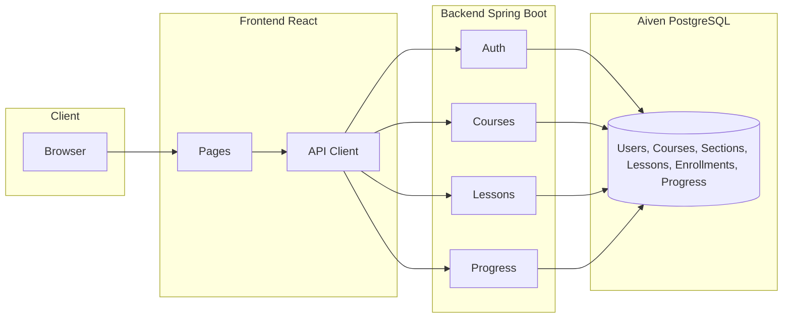

# Learnova – Architecture

## High-level flow

## Data flow

1. **User signup/login**  
   Frontend sends credentials to `POST /api/auth/signup` or `POST /api/auth/login`. Backend validates, hashes passwords with BCrypt, issues JWT. Frontend stores token and user in localStorage and sends `Authorization: Bearer <token>` on subsequent requests.

2. **Course enrollment**  
   Authenticated user calls `POST /api/courses/{courseId}/enroll`. Backend creates an enrollment row (user_id, course_id, enrolled_at). Only enrolled users can record progress.

3. **Lesson fetch**  
   When opening a course (e.g. Learning page), frontend calls `GET /api/courses/{courseId}/lessons`. Backend returns lesson list (title, order, youtube_url, etc.) and progress (completed flags, lastWatchedLessonId, progressPercent). Frontend renders the sidebar and sets the initial video from the first or last-watched lesson.

4. **Video and progress**  
   Frontend embeds YouTube via iframe using the lesson’s YouTube URL (or video ID). When the user clicks “Mark as complete”, frontend calls `POST /api/courses/{courseId}/progress` with `{ lessonId, completed: true }`. Backend upserts progress (user_id, course_id, lesson_id, completed, last_watched_at) and returns updated completedCount and progressPercent. Progress percentage = (completed lessons / total lessons) × 100.

5. **Resume**  
   Backend includes `lastWatchedLessonId` in the lessons response. Frontend selects that lesson (or the first) when opening the course so the student resumes from the last watched lesson.

## Components

- **Frontend**: React with Vite; React Router for routes; Axios for API client (base URL + JWT interceptor). Pages: CourseListing (and shared CourseBrowse), CourseDetails, Learning, Dashboard, Login, Signup. Navbar shows Login/Signup when unauthenticated and profile dropdown + Logout when authenticated.
- **Backend**: Spring Boot with MVC. Controllers: AuthController, CourseController, DashboardController, LessonController, ProgressController. Services and JPA repositories for User, Course, Section, Lesson, Enrollment, Progress. Security: JwtAuthenticationFilter, BCrypt, permitAll for auth and public GETs; authenticated for enroll, progress, dashboard.
- **Database**: PostgreSQL (Aiven). Only metadata is stored; video content is referenced by YouTube URL. Schema in `database/schema.sql`.

## Security

- Passwords: BCrypt only.
- JWT: HS256; secret and expiration configurable; validated on each request for protected endpoints.
- CORS: Configured for allowed frontend origins.
- No video files stored; only YouTube URLs in DB.
